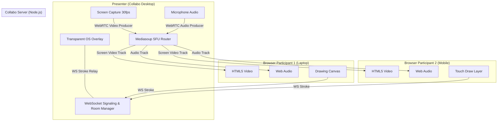

# Collabo — Real-Time Screen-Draw Meeting Platform

<div align="center">
  <h3>Collaborative Screen Sharing, Multi-User Live Annotation & Crystal-Clear Voice</h3>
  <p>Engineered for high-bandwidth engineering design reviews, pair programming, and product walkthroughs.</p>
</div>

---

## 🌟 Overview

**Collabo** is a focused, invite-only screen-draw meeting web & desktop platform designed around one core interaction:
> **One person shares their screen, everyone else draws on top of it in real time, and everyone communicates over low-latency audio.**

Unlike traditional meeting software where annotation is trapped inside a browser tab, Collabo introduces **Collabo Desktop** — a native Electron host application featuring a **transparent, click-through, always-on-top operating system overlay**. When remote participants annotate the screen, their strokes appear overlaid directly on the presenter's actual Windows/macOS desktop (VS Code, CAD, Figma, Terminal, or browser) without obstructing clicks or keystrokes.

---

## ⚡ Key Highlights

- **🖥️ Native Desktop OS Overlay:** Participants' annotations render directly on top of the presenter's active monitor using a hardware-accelerated, transparent, click-through window with zero input obstruction.
- **🌐 Zero-Install Web Participation:** Viewers join instantly in any modern web browser on desktop, tablet, or mobile — no accounts or installs required.
- **⚡ Mediasoup SFU Star Architecture:** Server-relayed WebRTC media distribution eliminates peer-to-peer mesh bottlenecks and enables 4K screen streaming at low CPU utilization.
- **⏱️ Ephemeral 5.0s Annotations:** Strokes stay solid for 5.0 seconds, then smoothly blur and fade out over 0.5s, preventing visual clutter during fast-paced reviews.
- **📐 Resolution-Independent Sync:** Floating-point normalized coordinates ($0.0 - 1.0$) guarantee millimeter-accurate alignment across 4K displays, laptops, and mobile viewports.
- **🔒 Invite-Only Ephemeral Rooms:** Meetings generate high-entropy 6-character authentication codes and are capped at **10 concurrent participants** in server memory.
- **🔄 Instant Presenter Handoff:** Presenter rights can be transferred to any participant at any time with automatic video producer lifecycle cleanup.

---

## 🏗️ Architecture & Media Topology



---

## 🚀 Quick Start

### 1. Prerequisites
- **Node.js:** v18+ (tested on Node.js v20+ and v26+)
- **npm:** v9+
- **C++ Build Tools:** Required for native `mediasoup` worker compilation.

### 2. Installation
```bash
git clone https://github.com/your-username/collabo.git
cd collabo
npm install
```

### 3. Start Development Server
```bash
npm run dev
```
Open [http://localhost:3000](http://localhost:3000) to view the web application.

### 4. Launch Desktop Host App (Presenter)
```bash
# Build Electron scripts
npm run build:electron

# Launch Collabo Desktop
npm run desktop
```

---

## 🧪 Automated Testing Suite

Collabo comes with an end-to-end integration and mathematical verification test suite:

```bash
# Run all test suites
npm test

# Run individual test suites
npm run test:e2e        # SFU transports, video routing, late joiners, 10-peer cap
npm run test:freeform   # Open curve non-closing drawing coordinate test
npm run test:ttl        # 5.0s lifetime + 0.5s blur-fade-away transition test
```

---

## 📁 Repository Structure

```
Collabo/
├── app/
│   ├── layout.tsx                # Global layout with ToastProvider
│   ├── page.tsx                  # Business-facing landing page & quick join
│   ├── join/[meetingId]/page.tsx # Direct join form (pre-filled from sessionStorage)
│   ├── room/[meetingId]/page.tsx # Full active meeting room interface
│   ├── desktop-host/page.tsx     # Presenter control dashboard for Electron
│   └── api/meetings/route.ts     # REST API for meeting creation and validation
├── electron/
│   ├── main.ts                   # Electron main process (OS overlay, capturer IPC, deep link)
│   ├── preload.ts                # Context bridge for Host Control window
│   ├── preload-overlay.ts        # Context bridge for Transparent Overlay window
│   ├── overlay.html              # High-DPI transparent click-through canvas
│   └── control.html              # Offline fallback control window
├── components/
│   ├── ui/                       # Minimal component kit (Button, Input, Modal, Toast, Avatar)
│   └── room/                     # Room components (ScreenView, DrawCanvas, ControlBar, ParticipantStrip)
├── server/
│   ├── ws-server.ts              # Node.js server orchestrating Next.js + WS + Mediasoup
│   ├── rooms.ts                  # In-memory RoomManager, peer state, color allocation
│   ├── sfu.ts                    # Mediasoup worker, router, and WebRTC transport lifecycle
│   └── config.ts                 # Port ranges, listen IPs, and RTP capabilities
├── lib/
│   ├── mediasoup-client.ts       # Client-side Device, Transports, Audio & Video Producers/Consumers
│   ├── draw-sync.ts              # Canvas rendering loop, normalized coordinate math, TTL curves
│   ├── session.ts                # sessionStorage display name persistence
│   └── types.ts                  # Shared TypeScript interfaces and protocol schemas
├── tests/
│   ├── run-all.ts                # Master test runner
│   ├── e2e-room.test.ts          # E2E room lifecycle and SFU media routing
│   ├── draw-freeform.test.ts     # Open curve non-looping drawing tests
│   └── draw-ttl.test.ts          # 5s lifetime + 0.5s blur-fade transition tests
├── docs/                         # Detailed architectural & engineering documentation
│   ├── ARCHITECTURE.md
│   ├── DESKTOP_HOST_APP.md
│   ├── API_AND_SIGNALING.md
│   ├── GETTING_STARTED.md
│   └── DRAWING_ENGINE.md
└── package.json
```

---

## 📚 Documentation

For in-depth technical guides, consult the [`docs/`](./docs) directory:
- [Architecture & SFU Topology](./docs/ARCHITECTURE.md)
- [Collabo Desktop & OS Overlay](./docs/DESKTOP_HOST_APP.md)
- [API & WebSocket Signaling Protocol](./docs/API_AND_SIGNALING.md)
- [Drawing Engine & Ephemeral TTL](./docs/DRAWING_ENGINE.md)
- [Getting Started & Deployment Guide](./docs/GETTING_STARTED.md)

---

## 📄 License

Distributed under the MIT License. See `LICENSE` for more information.

**Author:** Rayian Mahi ([rbsmahi@gmail.com](mailto:rbsmahi@gmail.com))
