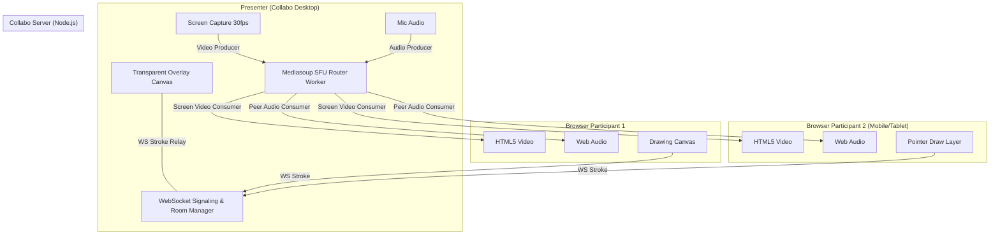

# Collabo Architecture & Media Topology

Collabo uses a **Selective Forwarding Unit (SFU)** star network architecture orchestrated by **Mediasoup** in Node.js, coupled with standard **WebSockets** for real-time room signaling and drawing synchronization.

---

## 1. System Topology Overview

---

## 2. Server Architecture

### 2.1 Multi-Tier Server Process

The custom server in [`server/ws-server.ts`](file:///C:/projects/Collabo/server/ws-server.ts) hosts three unified components:

1. **Next.js Engine:** Serves React App Router pages (`/`, `/join/[meetingId]`, `/room/[meetingId]`, `/desktop-host`) and API endpoints (`/api/meetings`).
2. **WebSocket Signaling Layer (`ws`):**
   - Manages room lifecycle, participant presence, and color assignments.
   - Enforces the 6-character auth code check and 10-peer room capacity cap.
   - Relays drawing strokes with sub-millisecond latency.
3. **Mediasoup SFU:**
   - Spawns C++ Mediasoup Workers.
   - Allocates one `Router` per active meeting room.
   - Manages WebRTC Transports (`send` and `recv`), handling DTLS negotiation and ICE candidate pairing.

---

## 3. WebRTC Media Routing (Star vs. Mesh)

### 3.1 Why SFU over Peer-to-Peer Mesh?

In a standard P2P mesh, every participant uploads their screen video and audio to every other participant ($N \times (N-1)$ connections). In a 10-person room, the host would upload 9 video streams, causing packet loss and massive bandwidth strain.

With Mediasoup SFU:
- **Host:** Uploads **1 video track** and **1 audio track** to the server.
- **Participants:** Upload **1 audio track** each to the server.
- **Server:** Routes incoming RTP packets to active consumers without transcoding, maintaining sub-100ms latency at minimal CPU overhead.

### 3.2 Late Joiner Video Synchronization

When a participant joins a room while screen sharing is already active:
1. The server notifies the new peer with a `new-producer` message for the host's video track.
2. Upon consumer creation, the server calls `consumer.requestKeyFrame()` on the Mediasoup producer.
3. The video encoder immediately emits a full IDR keyframe, preventing late joiners from seeing a black box or waiting for standard I-frame intervals.

---

## 4. Stroke Synchronization & Normalized Coordinates

All canvas annotations are stored and transmitted using **normalized coordinates** $(x, y \in [0.0, 1.0])$:

$$\text{normalized } x = \frac{\text{canvas pixel } x}{\text{container width}}, \quad \text{normalized } y = \frac{\text{canvas pixel } y}{\text{container height}}$$

### Benefits
- **Resolution Independence:** A stroke drawn on an iPhone or 1080p laptop scales with mathematical precision onto a 4K presenter display.
- **Bandwidth Efficiency:** Coordinates are serialized as compact 2-number arrays `[x, y]`, requiring under 1 KB/sec per active artist.
